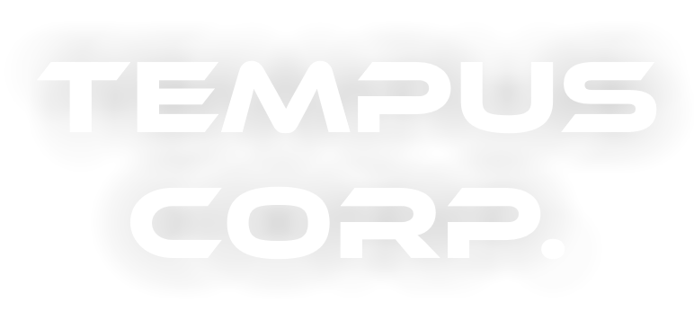
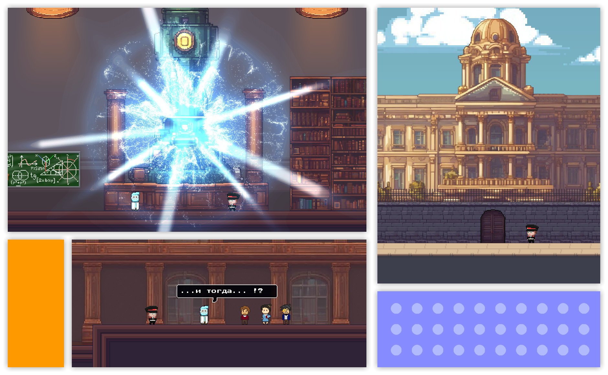
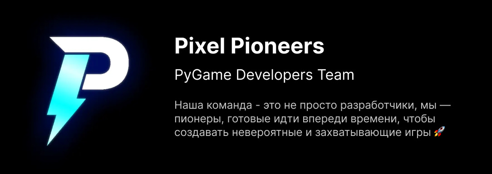

<h1 align="center"> Code Future Hackathon </h1>
<h4 align="center"> Pygame Platformer — Tempus Corp. </h4>

<p align="center">
  
</p>

<p>
  
Tempus Corp. - это захватывающий платформер, который отправит вас в захватывающее приключение через временные линии. В этой игре вы возьмете на себя роль кадета Алексея, отправившегося с профессором Маркусом в необычное приключение с путешествиями во времени.

Вам предстоит решать головоломки и помогать профессору осуществить важную миссию — улучшить качество обучения и воспитания в первых кадетских корпусах.

Игра Tempus Corp. была создана Pixel Pioneers специально для хакатона "Кодим Будущее", где участники были призваны использовать свои навыки программирования, чтобы создать игру в жанре платформер на Python. Tempus Corp. — идеальный пример того, как можно сочетать увлекательный геймплей с увлекательным сюжетом о путешествиях во времени.

</p>



<h2>Особенности игры</h2>

<ul>
  <li>Интересный сюжет 🎥</li></li>
  <li>Завораживающие механики 💡</li></li>
  <li>Красивая графика 🏞️</li></li>
  <li>Приветливый интерфейс ✅</li></li>
  <li>Крутые фичи 💥</li></li>
  <li>Фантастический мир 🚀</li></li>
</ul>

<h2>Как запустить</h2>

```bash
# Установка библиотеки Pygame
pip install pygame

# Запуск игры
python main.py
```

<h2>О команде</h2>

Мы занимаемся созданием действительно качественных и невообразимых проектов в игровой индустрии. Мы не боимся экспериментировать и идти впереди времени,
создавая что-то новое и удивительное. Мы убеждены, что истинное искусство разработки игр заключается в способности удивлять, вдохновлять и заставлять игроков
переживать невероятные приключения. Мы стремимся к тому, чтобы каждый наш проект был не просто игрой, а настоящим произведением искусства, способным потрясти
и захватить воображение.

